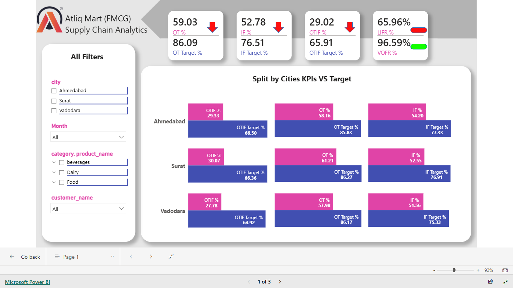
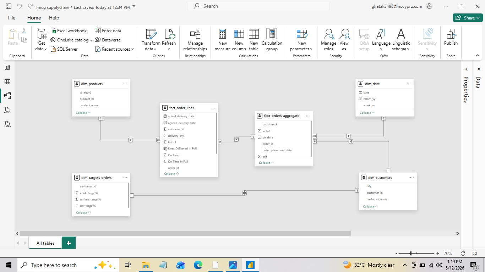

# Supply-Chain-Analytics---FMCG-manufacturer-in-India 📈

## 🚀 Project Overview

AtliQ Mart, a growing FMCG manufacturer in India, is facing service level issues where key customers are not extending annual contracts due to delivery delays and incomplete orders. This project involves building a professional supply chain dashboard to track **On-Time (OT) %**, **In-Full (IF) %**, and **On-Time In-Full (OTIF) %** on a daily basis against set targets.

## 📊 Business Problem

Management speculated that essential products were not being delivered reliably, leading to poor customer service. The objective is to monitor these service levels swiftly to fix issues before expanding operations to other Tier 1 cities.

## 📊 Dashboard Preview

## 🛠️ Technical Implementation (DAX & Modeling)

**Data Modeling:** Developed a Star Schema connecting Fact tables (`fact_order_lines`, `fact_orders_aggregate`) with Dimension tables (`dim_customers`, `dim_products`, `dim_date`, `dim_targets_orders`).

**Field Parameters:** Implemented a "Metric Switch" button to allow dynamic toggling between different KPIs (OTIF, OT, IF, LIFR, VOFR) in a single trend chart.

**KPIs Calculated:** 
**OTIF %:** Orders delivered both on time and in full.
**LIFR (Line Fill Rate):** Percentage of order lines delivered in full quantity.
**VOFR (Volume Fill Rate):** Ratio of total delivered quantity to requested quantity.

## 💡 Key Insights from Dashboard

* **Performance Gap:** All three primary cities (Ahmedabad, Surat, Vadodara) are currently performing significantly below their OTIF targets (Actual ~29% vs Target ~66%).
* **Customer Reliability:** Some major customers like **Coolblue** have an extremely low OTIF % (13.75%), indicating a critical need for supply chain optimization for these accounts.
* **Product Trends:** Detailed product-level analysis shows which specific items (like **AM Biscuits** or **AM Ghee**) are contributing to fill rate issues.

## 📂 Project Structure

---

### ✍️ Author
**[Neeraj Singh]**
*Data Analyst | SQL | Power BI | Python*
<a href="https://www.linkedin.com/in/neerajsinghdatanerd/" target="_blank">[LinkedIn Profile Link]</a>
<a href="https://app.powerbi.com/view?r=eyJrIjoiZjNhMjE5ZGMtMDU4OS00NzBiLTg1NzgtNTY2NDY4ZTQ0ZDA3IiwidCI6ImRmODY3OWNkLWE4MGUtNDVkOC05OWFjLWM4M2VkN2ZmOTVhMCJ9">[Power BI Report Link]</a>
